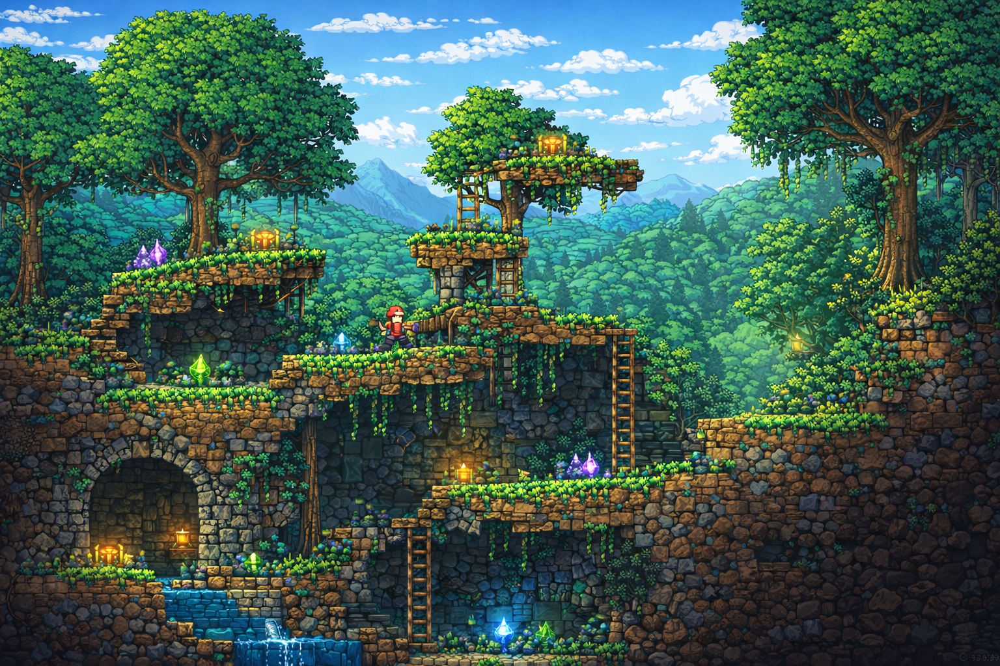
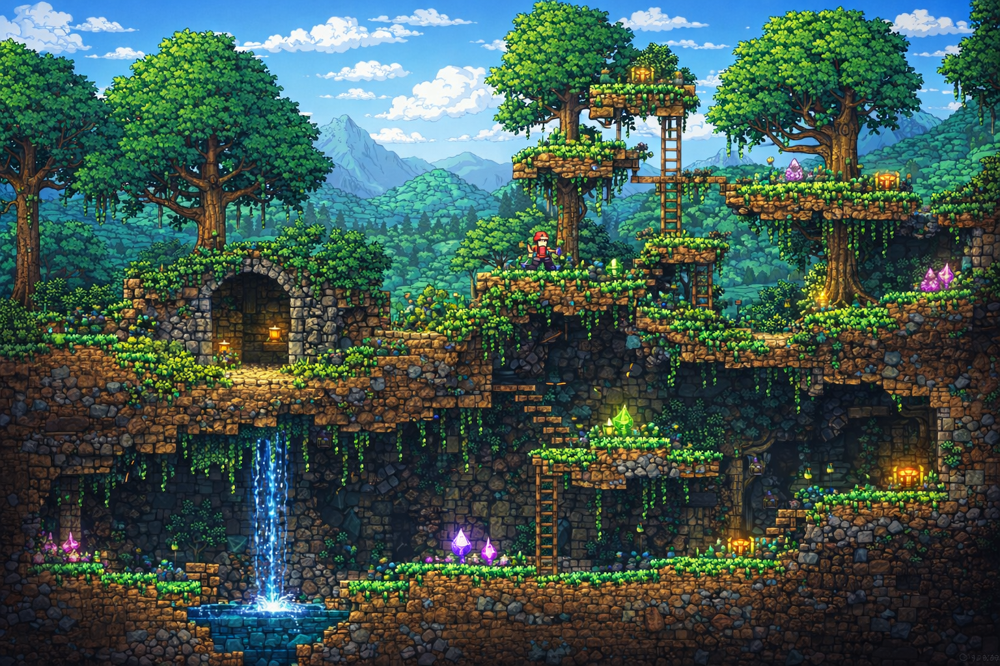

# Crumbling Coffers  
A competitive multiplayer Metroidvania-style platformer centered around nonlinear exploration, strategic item collection, and time-based scoring. Players navigate interconnected levels filled with movement challenges, hidden paths, and unlockable abilities that expand traversal options as the match progresses. Each session emphasizes speed, routing efficiency, and smart decision-making, rewarding players not just for collecting items, but for optimizing their path and adapting to opponents in real time. The result is a fast-paced experience that blends precision platforming with competitive depth and replayability.

---

## Table of Contents
* [General Info](#general-information)
* [Technologies Used](#technologies-used)
* [Features](#features)
* [Screenshots](#screenshots)
* [Sprint 1](#sprint-1)

---

## General Information

**Crumbling Coffers** is a multiplayer platformer inspired by Metroidvania design principles.

The game features a large vertically explorable map filled with caves and interconnected areas. Players can traverse upward and downward freely, discovering items scattered across the environment.

The core objective is competitive collection:
- Up to **6 active players** compete within the same map.
- Items have different **rarity tiers** and **score values**.
- Matches are **time-based**.
- After time expires, a **scoreboard** displays all collected items and calculates each player's total score.

The game also includes temporary **boost items (spells)** that enhance abilities such as stamina, speed, and jump height, adding strategic depth to exploration and competition.

---

## Technologies Used

- **Godot Engine** – Rendering, physics, scene management, and cross-platform support.
- **C# (Client)** – Gameplay logic, input handling, UI, client-side prediction and interpolation.
- **C (Dedicated Server)** – Authoritative server handling networking, simulation ticks, session management, and state synchronization.
- **SQLite** – Embedded database for storing player accounts, statistics, progression, and leaderboard data.

---

## Features

- Large vertically and horizontally explorable map  
- Multiplayer support (planned: 6 players per match)  
- Item system with rarity tiers and score values  
- Timed competitive matches  
- End-of-match scoreboard with score calculation  
- Temporary boost items affecting player abilities  

---

## Screenshots (Initial Vision)

---

## Sprint 1

TBD
