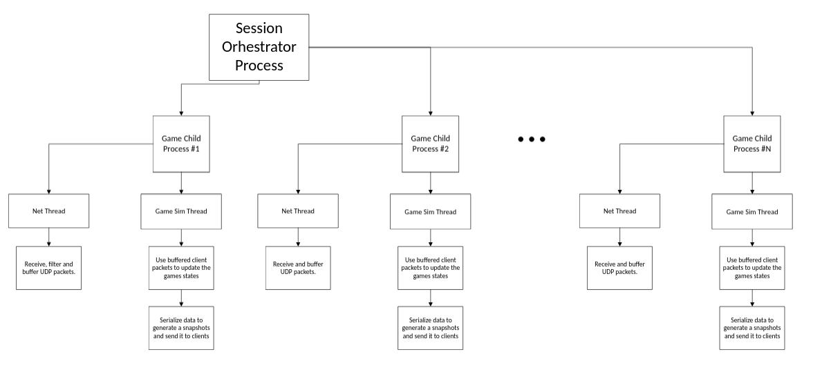

# Server Architecture

The server architecture consists of two main entities:

- **Session Orchestrator Process**
- **Child Game Process**

## High-Level Architecture Diagram 

--- 

# Session Orchestrator Process

The Session Orchestrator is a single parent process responsible for coordinating game sessions.

## Responsibilities

- Establish and maintain **TCP communication** with clients
- Form games and fill them with players
- Spawn a **Child Game Process** for each active game
- Maintain a queue of players waiting to join a game
- Maintain a queue of available ports for child processes
- Enforce a cap on the number of concurrent game processes (resource limitation)

Once a game is created:

1. The orchestrator assigns an available port to the child process.
2. The assigned port is sent to all participating clients.
3. The TCP connection between orchestrator and client is closed.
4. All further communication happens directly between clients and the Child Game Process using **UDP**.

---

# Game Server Process

The Game Server Process contains 2 concurrent threads.

## Net Thread

- Continuously waits for and receives client UDP packets  
- Buffers packets into a shared data structure  
- Never touches or modifies game state  

---

## Game Simulation Thread

- Reads buffered UDP packets from clients  
- Uses those packets to update the authoritative server game simulation  
- Serializes data and sends game state snapshots to clients  
- The only thread allowed to modify `Game` state
