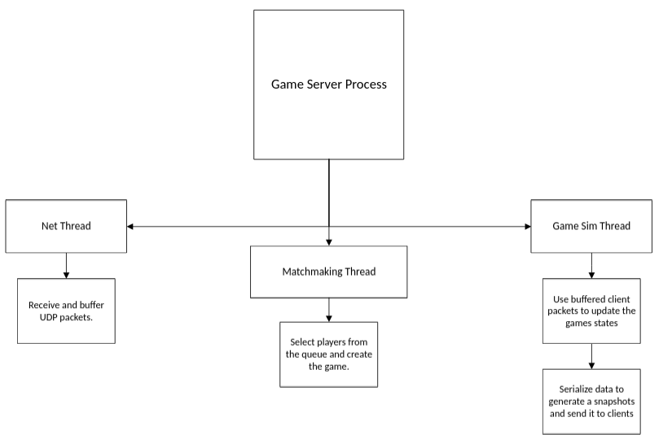

# Game Server Process

The Game Server Process contains three concurrent threads.

---

## Net Thread

- Continuously waits for and receives client UDP packets  
- Buffers packets into a shared data structure  
- Never touches or modifies active game state  

---

## Game Simulation Thread

- Reads buffered UDP packets from clients  
- Uses those packets to update the authoritative server game simulation  
- Serializes data and sends game state snapshots to clients  
- The only thread allowed to modify `Game` structures  

---

## Matchmaking Thread

- Maintains players queue who wants to join the game   
- Processes client game join requests  
- Adds players to the queue and forms matches  
- Creates a `Game` structure once players are selected  
- Passes the created game to the Games Storage, where the Game Simulation Thread takes ownership  
- Never touches or modifies the game after it has been handed off to the Game Simulation Thread  

---

## High-Level Architecture Diagram 



---

# Implementation Specification

## Net Thread

### Net Thread Shutdown Signaling

The Net Thread supports controlled shutdown using an atomic stop flag:

-   `stop == 0` → continue execution
-   `stop == 1` → exit the receive loop and terminate

The parent thread signals Net Thread shutdown by atomically setting
`stop = 1`
During shutdown, the socket must be closed or otherwise unblocked to
ensure `recvfrom()` returns and the loop can terminate.

------------------------------------------------------------------------

### Initializing a Socket

The Net Thread opens a UDP socket and binds it to a specific port:

``` c
int sockfd = socket(AF_INET, SOCK_DGRAM, 0);
bind(sockfd, (struct sockaddr *)&addr, sizeof(addr));
```

The port value is meant to be constant at the moment. Later, it will redesigned to be more scalable. 

------------------------------------------------------------------------

### Packet Receiving

The Net Thread executes the `recvfrom()` system call in blocking mode to
listen for incoming UDP packets. Once a datagram is received, its type
is validated and classified.

There are two packet categories:

-   **Regular packets** --- buffered into the regular input buffer.
-   **Event-reliable packets** --- require an acknowledgment (ACK) to be
    sent and are buffered into a dedicated reliable-events buffer.

The internal buffer structures are defined in a separate section.

The Net Thread operates as follows:

``` c
while (!stop)
{
    recvfrom(sockfd, buffer, sizeof(buffer), 0, ...);

    determine_packet_type(...);

    buffer_message(...);

    continue;
}
```

------------------------------------------------------------------------

### Buffering Structures 

TODO:


## Game Simulation Thread 

## Matchmaking Thread 

